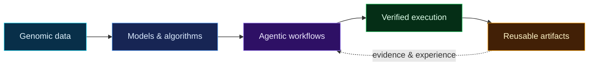

<p align="center">
  
</p>

<p align="center">
  <a href="https://github.com/sluminositys?tab=repositories"></a>
  <a href="https://github.com/sluminositys?tab=stars"></a>
  
</p>

<p align="center">
  <samp>Genomics × AI · Agentic systems · Research engineering</samp>
</p>

## Research console

```python
sluminosity = {
    "questions": ["How can models read genomes?", "How can agents improve research?"],
    "building":  ["genomic AI", "executable workflows", "durable research tools"],
    "principles": ["reproducible", "auditable", "useful"],
}
```

I work where **human genomics**, **machine learning**, and **research infrastructure** meet—turning scientific questions into systems that can be executed, inspected, and reused.

## Featured systems

<table>
  <tr>
    <td width="50%" valign="top">
      <h3>🧬 <a href="https://github.com/sluminositys/ArchaicSeeker3.0">ArchaicSeeker 3</a></h3>
      <p>Mamba-based detection of Neanderthal and Denisovan introgression segments in modern human genomes, designed for large-scale multi-GPU analysis.</p>
      <p><code>Population Genomics</code> <code>Mamba</code> <code>PyTorch</code></p>
    </td>
    <td width="50%" valign="top">
      <h3>🕸️ <a href="https://github.com/sluminositys/LATTICE">LATTICE</a></h3>
      <p>A layered, tool-augmented agent system that turns bioinformatics requests into verifiable, executable, auditable, and evolving workflows.</p>
      <p><code>Agents</code> <code>Knowledge Graphs</code> <code>Bioinformatics</code></p>
    </td>
  </tr>
  <tr>
    <td colspan="2" valign="top">
      <h3>✨ <a href="https://github.com/sluminositys/Atria">Atria</a></h3>
      <p>A desktop-first HTML artifact workspace for collecting, annotating, organizing, and reusing AI-generated coding and research outputs—with MCP-native agent access.</p>
      <p><code>Tauri</code> <code>React</code> <code>TypeScript</code> <code>MCP</code></p>
    </td>
  </tr>
</table>

## From question to research artifact



## Tech constellation

<p align="center">
  
  
  
  
  
  
  
  
  
  
  
</p>

## Live telemetry

<p align="center">
  
</p>

<picture>
  <source media="(prefers-color-scheme: dark)" srcset="https://raw.githubusercontent.com/sluminositys/sluminositys/output/github-contribution-grid-snake-dark.svg" />
  <source media="(prefers-color-scheme: light)" srcset="https://raw.githubusercontent.com/sluminositys/sluminositys/output/github-contribution-grid-snake.svg" />
  
</picture>

<p align="center">
  <sub>Research should not end as an answer—it should become an executable, explainable, reusable system.</sub>
</p>
