  

  
  
  

  <samp>Genomics × AI · Agentic systems · Research engineering</samp>

## About

Working at the intersection of population genomics and artificial intelligence, I develop computational methods to uncover signals of human evolutionary history—and agentic systems that make complex bioinformatics research scalable, rigorous, and reproducible.

## Featured systems

<table>
  <tr>
    <td width="50%" valign="top">
      <h3>🧬 <a href="https://github.com/sluminositys/ArchaicSeeker3.0">ArchaicSeeker 3</a></h3>
      
Mamba-based detection of Neanderthal and Denisovan introgression segments in modern human genomes, designed for large-scale multi-GPU analysis.

      
<code>Population Genomics</code> <code>Mamba</code> <code>PyTorch</code>

    </td>
    <td width="50%" valign="top">
      <h3>🕸️ <a href="https://github.com/sluminositys/LATTICE">LATTICE</a></h3>
      
A layered, tool-augmented agent system that turns bioinformatics requests into verifiable, executable, auditable, and evolving workflows.

      
<code>Agents</code> <code>Knowledge Graphs</code> <code>Bioinformatics</code>

    </td>
  </tr>
  <tr>
    <td colspan="2" valign="top">
      <h3>✨ <a href="https://github.com/sluminositys/Atria">Atria</a></h3>
      
A desktop-first HTML artifact workspace for collecting, annotating, organizing, and reusing AI-generated coding and research outputs—with MCP-native agent access.

      
<code>Tauri</code> <code>React</code> <code>TypeScript</code> <code>MCP</code>

    </td>
  </tr>
</table>

## Tech stack

  

## Live telemetry

  

<picture>
  <source media="(prefers-color-scheme: dark)" srcset="https://raw.githubusercontent.com/sluminositys/sluminositys/output/github-contribution-grid-snake-dark.svg" />
  <source media="(prefers-color-scheme: light)" srcset="https://raw.githubusercontent.com/sluminositys/sluminositys/output/github-contribution-grid-snake.svg" />
  
</picture>

  Curious about genomes. Building tools that help researchers move from ideas to evidence.

